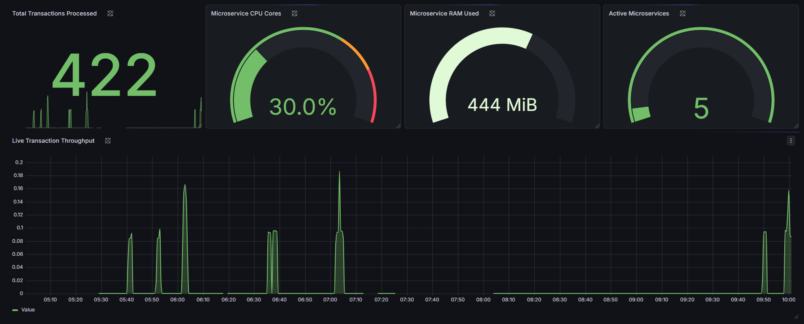

# 🌩️ Enterprise Fintech Disaster Recovery & Observability Platform

> A highly resilient, event-driven microservices architecture featuring an active-passive multi-cloud failover (AWS to Azure) with real-time observability and infrastructure as code.

[](https://www.linkedin.com/in/gerrardlewu/)
[]()
[]()

---

## 📖 Table of Contents
- [The Problem & The Solution](#-the-problem--the-solution)
- [Architecture Flow](#-architecture-flow)
- [Technologies Used](#-technologies-used)
- [Key Features & System Tests](#-key-features--system-tests)
- [Challenges & Engineering Solutions](#-challenges--engineering-solutions)
- [Local Installation & Setup](#-local-installation--setup)
- [Contributing](#-contributing)
- [Contact](#-contact)

---

## 🎯 The Problem & The Solution

**The Problem:** Financial institutions require 99.999% uptime and zero data loss. Relying on a single cloud provider creates a massive single point of failure (SPOF). Furthermore, tightly coupled monolithic databases make it difficult to scale high-throughput transaction processing while maintaining a secure, immutable audit trail.

**The Solution:** I engineered a hybrid-cloud, event-driven microservices platform. 
* A **NestJS API gateway** handles incoming transactions, enforcing rate-limiting and writing to a primary **PostgreSQL** relational ledger. 
* To decouple the architecture, the API publishes events to a managed message broker (**AWS SQS**). 
* A highly concurrent **.NET Core Worker Service** consumes these messages and archives them in a **MongoDB** document database for immutable auditing.
* **The ultimate failsafe:** If the primary AWS us-east-1 region experiences an outage, a custom Circuit Breaker dynamically intercepts the failure and reroutes the financial data to a standby **Microsoft Azure Service Bus**, guaranteeing zero data loss.

---

## 🏗️ Architecture Flow


*(Placeholder: System architecture diagram showing K8s, AWS, Azure, and the database flows).*

1. Client sends transaction burst via the Load Generator.
2. NestJS API receives, throttles (if necessary), and commits to **Postgres**.
3. API attempts to push event payload to **AWS SQS**.
4. *[If AWS Fails]* Circuit Breaker trips → API pushes payload to **Azure Service Bus**.
5. **.NET Auditor** constantly polls the active queue, pulling messages and storing the audit trail in **MongoDB**.
6. **Prometheus & Grafana** scrape system metrics for live observability.

---

## 🛠️ Technologies Used

**Cloud & Infrastructure:**
* **AWS:** Elastic Container Registry (ECR), Simple Queue Service (SQS)
* **Microsoft Azure:** Service Bus
* **Infrastructure as Code:** HashiCorp Terraform
* **Container Orchestration:** Docker, Kubernetes (Local Desktop Cluster), Helm

**Microservices:**
* **API Gateway:** Node.js, NestJS, TypeScript, TypeORM
* **Background Worker:** C#, .NET Core 8
* **Databases:** PostgreSQL (Ledger), MongoDB (Audit Trail)

**DevOps & Observability:**
* **CI/CD:** GitHub Actions
* **Security Scanning:** Trivy Container Scanning
* **Observability:** Prometheus, Grafana

---

## ⚙️ Key Features & System Tests

### 1. Multi-Cloud Active-Passive Failover (Disaster Recovery)
The core feature of this platform. To test the DR capabilities, I intentionally sabotage the AWS routing configuration inside Kubernetes to simulate a total regional outage. The application catches the failure in real-time and reroutes traffic to Azure.
To manually trigger the failover and watch the circuit breaker activate, run the following command to intentionally break the AWS SQS connection:
```bash
kubectl set env deployment/fintech-api AWS_SQS_QUEUE_URL="[https://sqs.us-east-1.amazonaws.com/000000000000/broken-queue](https://sqs.us-east-1.amazonaws.com/000000000000/broken-queue)"
```


*(GIF showing the terminal logs failing on AWS and successfully routing to Azure).*

### 2. API Rate Limiting & Throttling
To protect the backend from DDoS attacks or runaway client scripts, the API utilizes a strict Throttler logic. Bursting 10+ requests in a second results in an HTTP 429 response.


*(GIF of the Python load generator hitting the 429 Too Many Requests wall).*

### 3. Real-Time Observability
The platform features native Prometheus metrics exported to a Grafana dashboard, tracking transaction throughput, database query times, and pod health.


*(GIF of the beautiful Grafana charts).*

---

## 🧠 Challenges & Engineering Solutions

Building a distributed, multi-cloud system locally presented several complex DevOps challenges:

**1. Kubernetes Security Isolation vs. Private Cloud Registries**
* **Challenge:** After provisioning my AWS ECR repository via Terraform, my local Kubernetes cluster continually threw `ImagePullBackOff` errors. Even though my host machine was authenticated via the AWS CLI, the isolated Kubernetes Kubelet lacked permissions to pull from private cloud registries.
* **Solution:** I resolved this by generating an AWS authorization token, passing it into Kubernetes as a `docker-registry` Secret, and updating the Helm deployment manifests to explicitly attach `imagePullSecrets` to the pod specs.

**2. The "Too Smart" AWS SDK and Testing the Circuit Breaker**
* **Challenge:** While attempting to test my multi-cloud circuit breaker, I intentionally changed the API's configured AWS Region to `"broken-region"`. However, the AWS SDK intelligently parsed the `us-east-1` string embedded inside the SQS Queue URL and successfully routed the message anyway, bypassing my simulated outage.
* **Solution:** To guarantee a failure and prove the Azure fallback, I had to update the Helm configuration to mutate the actual SQS Queue URL to a non-existent endpoint, forcing a catastrophic timeout that successfully tripped the Circuit Breaker.

**3. Decoupling Monolithic Transactions via Event-Driven Design**
* **Challenge:** Ensuring that a transaction saved to the relational database is *always* logged in the audit database without tightly coupling the databases or creating massive API latency.
* **Solution:** I implemented an Event-Driven architecture using AWS SQS. The API returns a successful 200 OK response to the client immediately after writing to Postgres and pushing to the queue. The .NET worker handles the heavy lifting of MongoDB insertion asynchronously, allowing the API to maintain high throughput.

---

## 🚀 Local Installation & Setup

This project requires active AWS and Microsoft Azure accounts to provision the multi-cloud message brokers. 

**Prerequisites:**
* Python 3.x (for the load generator script)
* Docker Desktop (with Kubernetes enabled)
* AWS CLI & Azure CLI (Authenticated via `aws configure` and `az login`)
* Terraform & Helm installed

You can deploy the platform using the **Automated Setup** (recommended for quick evaluation) or the **Manual Setup** (for exploring the infrastructure steps).

### Option A: Automated Setup (The Fast-Track)
I wrote a deployment script that provisions the Terraform infrastructure, dynamically extracts your cloud credentials, injects them securely into Kubernetes, and deploys the Helm charts automatically.

Run this from the root of the project:
```bash
chmod +x start-demo.sh
./start-demo.sh
```

### Option B: Manual Setup (The Engineer Path)

**1. Provision Cloud Infrastructure**
Navigate to the Terraform directory and build the AWS SQS queues and Azure Service Bus namespaces.
```bash
cd infra/terraform
terraform init
terraform apply -auto-approve
```

**2. Inject Cloud Secrets to Kubernetes**
The Kubernetes Kubelet requires explicit permissions to pull images from your private AWS ECR, and the API needs the Azure connection string.
```bash
# Extract AWS credentials and create the Docker Registry secret
AWS_ACCOUNT_ID=$(aws sts get-caller-identity --query Account --output text)
kubectl create secret docker-registry ecr-secret \
  --docker-server=${AWS_ACCOUNT_ID}.dkr.ecr.us-east-1.amazonaws.com \
  --docker-username=AWS \
  --docker-password=$(aws ecr get-login-password --region us-east-1)

# Extract Azure connection string from Terraform and create generic secret
AZURE_CONN=$(terraform output -raw azure_servicebus_connection_string)
kubectl create secret generic azure-credentials \
  --from-literal=AZURE_SERVICEBUS_CONNECTION_STRING="${AZURE_CONN}"
```

**3. Deploy the Platform via Helm**
Return to the root directory and deploy the microservices.
```bash
cd ../../
helm install fintech-stack ./infra/helm/fintech-platform
```

**4. Generate Traffic**
```bash
python scripts/load_gen.py
```

**5. View the Live Dashboard**
To see the system metrics in real-time, port-forward Grafana to your local machine:
```bash
kubectl port-forward svc/grafana 8080:80
```

---
## 🧹 Tear Down
To avoid incurring unnecessary cloud charges from AWS and Azure, ensure you destroy the infrastructure once you are finished evaluating the platform:

```bash
# 1. Remove the Kubernetes deployments
helm uninstall fintech-stack

# 2. Destroy the multi-cloud infrastructure
cd infra/terraform
terraform destroy -auto-approve
```

---
## 🤝 Contributing
This is a personal portfolio project intended to demonstrate Cloud Engineering and DevOps methodologies. However, feel free to fork the repository, deploy it to your own cloud environments, and play around with the multi-cloud configurations!

## 📫 Contact
**Gerrard Lewu** - Aspiring Cloud / DevOps Engineer  
[Connect on LinkedIn](https://www.linkedin.com/in/gerrardlewu/)
